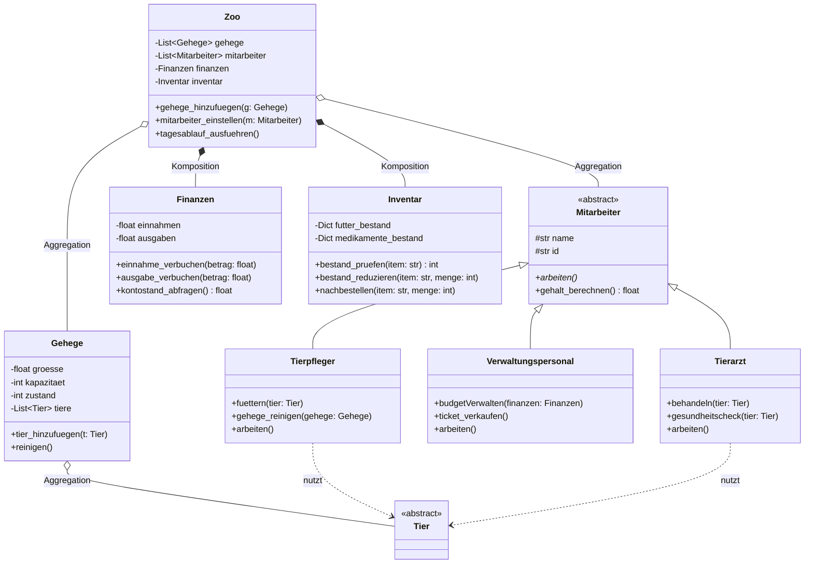
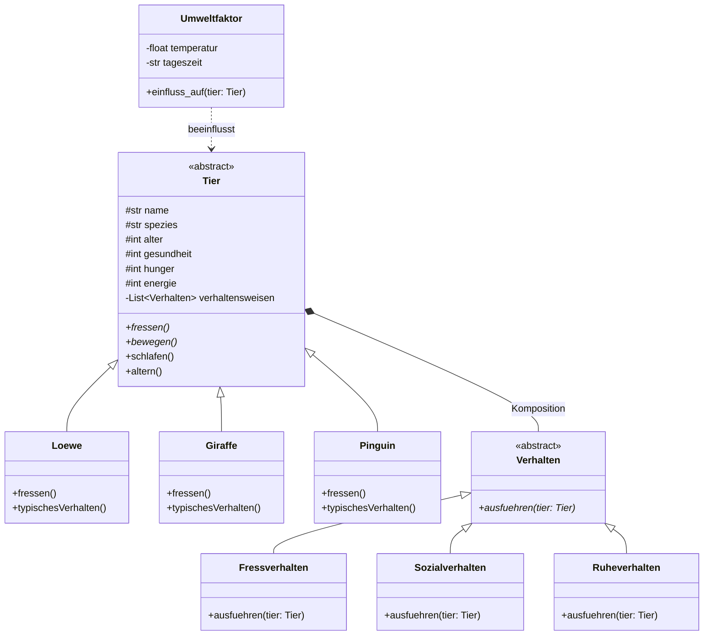
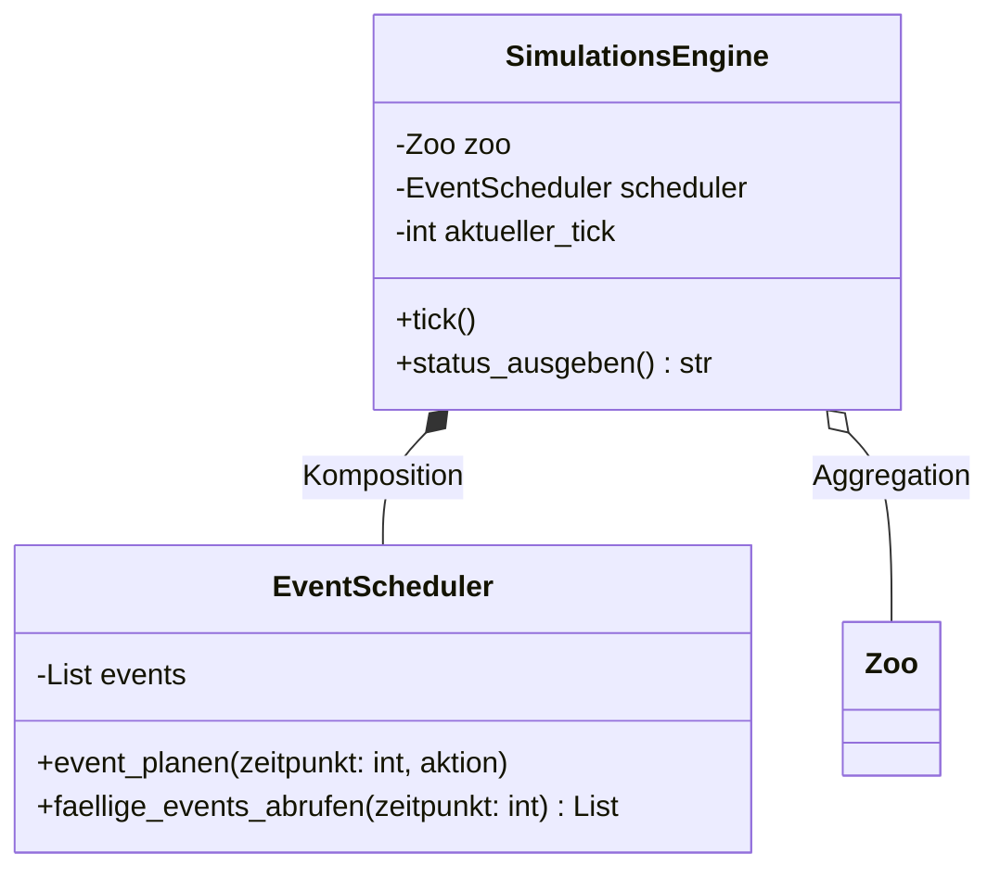
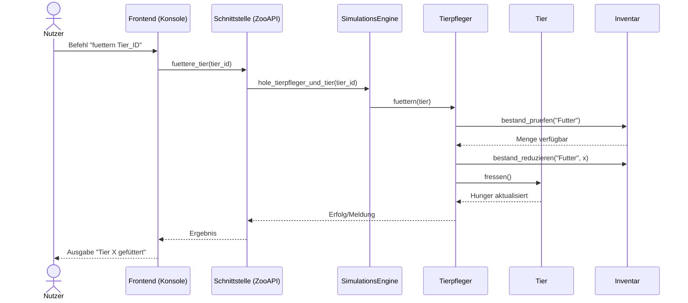
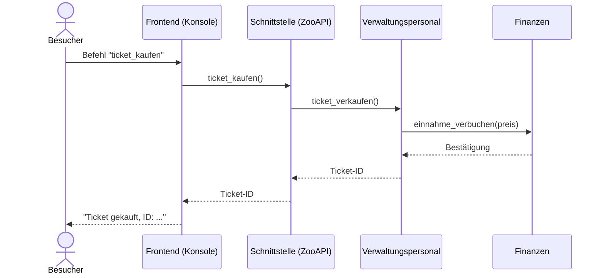

# Digitaler Zwilling einer Zoo-Simulation — Planung & Vorgehen

## 1. Gesamtarchitektur

Vier strikt getrennte Schichten, jede als eigenes Package/Verzeichnis, kommunizieren nur über definierte Schnittstellen (keine Cross-Imports zwischen Backend-Internals und Frontend):

```
zoo_simulation/
├── backend/                 # Domänenlogik (Teilbereich 1 + 2 + 3)
│   ├── verwaltung/           # Teilbereich 1: Zoo, Mitarbeiter, Gehege, Finanzen, Inventar
│   │   ├── zoo.py
│   │   ├── mitarbeiter.py           # abstrakte Basisklasse
│   │   ├── tierpfleger.py
│   │   ├── tierarzt.py
│   │   ├── verwaltungspersonal.py
│   │   ├── gehege.py
│   │   ├── finanzen.py
│   │   └── inventar.py
│   ├── tiere/                # Teilbereich 2: Tier, Arten, Verhalten, Umwelt
│   │   ├── tier.py                  # abstrakte Basisklasse
│   │   ├── loewe.py
│   │   ├── giraffe.py
│   │   ├── pinguin.py
│   │   ├── verhalten.py             # abstrakte Basisklasse/Interface
│   │   ├── fressverhalten.py
│   │   ├── sozialverhalten.py
│   │   ├── ruheverhalten.py
│   │   └── umweltfaktor.py
│   └── simulation/           # Teilbereich 3: Steuerung
│       ├── simulations_engine.py
│       └── event_scheduler.py
├── datenbank/                # Persistenzschicht (Repository-Pattern)
│   ├── repository.py                # abstraktes Interface (save/load/query)
│   ├── json_repository.py           # konkrete Implementierung (JSON-Dateien)
│   └── models.py                    # Mapping Objekt <-> Datensatz (Serialisierung)
├── schnittstelle/             # API-Schicht zwischen Frontend und Backend
│   └── zoo_api.py                    # Fassade: kapselt SimulationsEngine für UI/Konsole
├── frontend/
│   └── konsole.py                    # CLI-Interface (nutzt nur schnittstelle/zoo_api.py)
├── tests/
│   ├── test_mitarbeiter.md           # Testfälle (nur beschrieben, siehe Abschnitt 6)
│   ├── test_tiere.md
│   ├── test_verwaltung.md
│   └── test_simulation.md
├── docs/
│   ├── diagramme/                    # Mermaid-Dateien (.mmd)
│   └── README.md                     # Architekturübersicht + Zuständigkeiten (bei Gruppenarbeit)
└── main.py                           # Einstiegspunkt, startet Konsole
```

**Regel „eine Aufgabe = eine Datei"**: jede konkrete Unterklasse bekommt eine eigene Datei, keine Sammeldateien wie `tiere.py` mit allen Arten drin.

**Wichtig für Bewertung**: Die `schnittstelle/`-Schicht ist der Vertrag zwischen Frontend und Backend. Das Frontend darf NIE direkt `backend.verwaltung.zoo.Zoo` importieren, sondern nur `schnittstelle.zoo_api`. Das macht die Trennung im Code sichtbar und begründbar.

---

## 2. Teilbereich 1 — Zoo-Verwaltung: Klassendesign

### 2.1 Kernklassen

- **`Zoo`** (Komposition): hält `Gehege[]`, `Mitarbeiter[]`, `Finanzen` (1:1, Komposition), `Inventar` (1:1, Komposition). Methoden: `gehege_hinzufuegen()`, `mitarbeiter_einstellen()`, `tagesablauf_ausfuehren()`.
- **`Mitarbeiter`** (ABC): Attribute `_name`, `_id` (gekapselt, per Property zugänglich), abstrakte Methode `arbeiten()`. Gemeinsame Methode `gehalt_berechnen()`.
- **`Tierpfleger(Mitarbeiter)`**: `füttern(tier: Tier)`, `gehege_reinigen(gehege: Gehege)`.
- **`Tierarzt(Mitarbeiter)`**: `behandeln(tier: Tier)`, `gesundheitscheck(tier: Tier)`.
- **`Verwaltungspersonal(Mitarbeiter)`**: `budgetVerwalten(finanzen: Finanzen)`, `ticket_verkaufen()`.
- **`Gehege`**: Attribute `_groesse`, `_kapazitaet`, `_zustand` (Sauberkeit als Property mit Setter-Validierung: 0–100), Liste `_tiere` (Aggregation — Tiere existieren auch unabhängig vom Gehege denkbar).
- **`Finanzen`**: `_einnahmen`, `_ausgaben` (privat), Methoden `einnahme_verbuchen()`, `ausgabe_verbuchen()`, `kontostand_abfragen()` — keine direkte Attributmanipulation von außen möglich (Kapselung).
- **`Inventar`**: verwaltet `Dict[Futtertyp, Menge]` und `Dict[Medikament, Menge]`, Methoden `bestand_pruefen()`, `bestand_reduzieren()`, `nachbestellen()`.

### 2.2 Mermaid-Klassendiagramm (Teilbereich 1)



---

## 3. Teilbereich 2 — Tiersimulation: Klassendesign

- **`Tier`** (ABC): Attribute `_name`, `_spezies`, `_alter`, `_gesundheit` (0–100), `_hunger` (0–100), `_energie` (0–100) — alle als Properties mit Wertebereichs-Validierung im Setter (Kapselung). Abstrakte Methoden `fressen()`, `bewegen()`. Konkrete Methoden `schlafen()`, `altern()` (Basislogik, ggf. überschreibbar).
- **`Löwe(Tier)`**, **`Giraffe(Tier)`**, **`Pinguin(Tier)`**: überschreiben `fressen()` (art-spezifische Nahrungspräferenz) und `typischesVerhalten()`.
- **`Verhalten`** (ABC/Interface): Methode `ausfuehren(tier: Tier)`.
- **`Fressverhalten`**, **`Sozialverhalten`**, **`Ruheverhalten`**: konkrete Verhaltensklassen. Ein `Tier` hält eine Liste von `Verhalten`-Objekten (Komposition — Verhalten hat ohne Tier keinen Sinn).
- **`Umweltfaktor`**: `_temperatur`, `_tageszeit`, Methode `einfluss_auf(tier: Tier)` — verändert z.B. Energie/Hunger basierend auf Wetter.

### 3.1 Mermaid-Klassendiagramm (Teilbereich 2)



---

## 4. Teilbereich 3 — Simulationskern

- **`SimulationsEngine`**: hält Referenz auf `Zoo` und `EventScheduler`, Methode `tick()` — ruft in jedem Simulationsschritt: alle Tiere altern lassen, Hunger/Energie über `Umweltfaktor` anpassen, fällige Events aus `EventScheduler` ausführen.
- **`EventScheduler`**: verwaltet eine Liste/Priority-Queue von `(zeitpunkt, aktion)`-Paaren, Methoden `event_planen()`, `faellige_events_abrufen()`.

### 4.1 Mermaid-Klassendiagramm (Teilbereich 3)



### 4.2 Sequenzdiagramm: „Tierpfleger füttert Tier"



### 4.3 Sequenzdiagramm: „Besucher kauft Ticket"



---

## 5. Umsetzungsplan (Reihenfolge, iterativ)

**Phase 0 — Setup (0.5 Tag)**
Ordnerstruktur anlegen, `main.py`-Grundgerüst, Git-Repo initialisieren, `README.md` mit Zuständigkeitsverteilung (falls Gruppe).

**Phase 1 — Teilbereich 2 zuerst (Tiere), 2–3 Tage**
Grund dafür: `Tier` wird von `Gehege` und `Tierpfleger` referenziert, daher zuerst fertigstellen, um Abhängigkeiten sauber aufzulösen.
1. `Tier` (ABC) mit Properties + Validierung.
2. `Löwe`, `Giraffe`, `Pinguin`.
3. `Verhalten` (ABC) + drei konkrete Verhaltensklassen, Komposition in `Tier` einbauen.
4. `Umweltfaktor`.
5. Unit-Test-Beschreibungen parallel schreiben (siehe Abschnitt 6).

**Phase 2 — Teilbereich 1 (Verwaltung), 3–4 Tage**
1. `Mitarbeiter` (ABC).
2. `Tierpfleger`, `Tierarzt`, `Verwaltungspersonal`.
3. `Finanzen`, `Inventar`.
4. `Gehege` (nutzt `Tier` aus Phase 1).
5. `Zoo` als Kompositionsklasse, die alles zusammenführt.

**Phase 3 — Teilbereich 3 (Simulationskern), 2 Tage**
1. `EventScheduler`.
2. `SimulationsEngine.tick()` — integriert Alterung, Umweltfaktor-Einfluss, fällige Events.

**Phase 4 — Datenbank/Persistenz, 1–2 Tage**
1. `repository.py` als abstraktes Interface (`save()`, `load()`).
2. `json_repository.py` als einfache Implementierung (JSON-Dateien pro Zoo-Zustand) — genügt für den Scope, zeigt aber die Schicht klar.

**Phase 5 — Schnittstelle + Frontend, 1–2 Tage**
1. `zoo_api.py`: Fassade, die alle Backend-Aktionen bündelt (Single Responsibility: nur Vermittlung, keine Logik).
2. `konsole.py`: einfache Text-Menüs (`fuettern`, `ticket_kaufen`, `tick`, `status`, `speichern`, `laden`).

**Phase 6 — Dokumentation & Diagramme finalisieren, 1 Tag**
Docstrings überall ergänzen (Google- oder NumPy-Style, konsequent), Mermaid-Dateien in `docs/diagramme/` ablegen, README mit Architekturübersicht.

**Phase 7 — Testbeschreibungen & Reflexion, 1 Tag**
Testfälle pro Funktion (siehe Abschnitt 6), Reflexionstext zum KI-Einsatz schreiben (welche Teile mit KI erstellt, wie verifiziert, was manuell angepasst wurde).

Gesamtaufwand grob: ~12–15 Arbeitstage bei einer Person, entsprechend skalierbar bei Gruppenarbeit über Schwerpunkte.

---

## 6. Teststrategie (nur Beschreibung, keine Implementierung — Vorgabe)

Format pro Funktion: **Testname, Vorbedingung, Aktion, erwartetes Ergebnis.** Mindestens 2 Testfälle je Funktion (Normalfall + Randfall).

Beispiel für `Tier.fressen()`:

| Test | Vorbedingung | Aktion | Erwartung |
|---|---|---|---|
| `test_fressen_reduziert_hunger` | `hunger = 80` | `tier.fressen()` | `hunger` sinkt um definierten Wert, bleibt ≥ 0 |
| `test_fressen_bei_hunger_null` | `hunger = 0` | `tier.fressen()` | `hunger` bleibt 0 (kein negativer Wert, Grenzwertprüfung) |

Beispiel für `Finanzen.ausgabe_verbuchen()`:

| Test | Vorbedingung | Aktion | Erwartung |
|---|---|---|---|
| `test_ausgabe_reduziert_kontostand` | `kontostand = 1000` | `ausgabe_verbuchen(200)` | `kontostand == 800` |
| `test_ausgabe_negativer_betrag_abgelehnt` | `kontostand = 1000` | `ausgabe_verbuchen(-50)` | `ValueError` wird ausgelöst, `kontostand` unverändert |

Dieses Muster (Normalfall + Randfall/Fehlerfall) auf **jede** öffentliche Methode aller Klassen aus Abschnitt 2–4 anwenden und in `tests/test_*.md` dokumentieren.

---

## 7. Checkliste gegen die Bewertungskriterien

| Kriterium | Wo im Plan abgedeckt |
|---|---|
| Klassenstruktur & Modellierung | Abschnitt 2–4, Mermaid-Diagramme |
| Vererbung & Polymorphie | `Mitarbeiter`→3 Unterklassen, `Tier`→3 Arten, `Verhalten`→3 Unterklassen |
| Kapselung & Datenintegrität | Properties mit Setter-Validierung (Abschnitt 2.1, 3) |
| Modularität & Erweiterbarkeit | Ordnerstruktur, eine Klasse = eine Datei, Repository-Pattern |
| Kernfunktionen & Simulationslogik | `SimulationsEngine.tick()`, Sequenzdiagramme Abschnitt 4.2/4.3 |
| Testplan & Testfälle | Abschnitt 6 |
| Code-Dokumentation | Docstring-Konvention in Phase 6 festlegen und durchziehen |
| Design-Visualisierung (Mermaid) | Abschnitt 2.2, 3.1, 4.1, 4.2, 4.3 |
| Reflexion & KI-Einsatz | Phase 7 — separat als Text im README/Abgabe dokumentieren |

**Wichtiger Hinweis zur Abgabe**: Da laut Aufgabenstellung nur der **Planungsteil die Individualleistung** ist, sollte bei Gruppenarbeit jeder Schwerpunkt (z.B. nur Teilbereich 1 oder nur Teilbereich 2) individuell in einem separaten Abschnitt der README mit Namen gekennzeichnet werden — unabhängig davon, wer den Code am Ende schreibt.

---

## 8. Nächster Schritt

Sag mir, ob du das Projekt allein oder in einer Gruppe machst und welchen Schwerpunkt du wählst (falls Gruppe) — dann kann ich direkt mit der Implementierung der Basisklassen (`Tier`, `Mitarbeiter`) in Python starten, inklusive vollständiger Docstrings und Property-basierter Kapselung.
