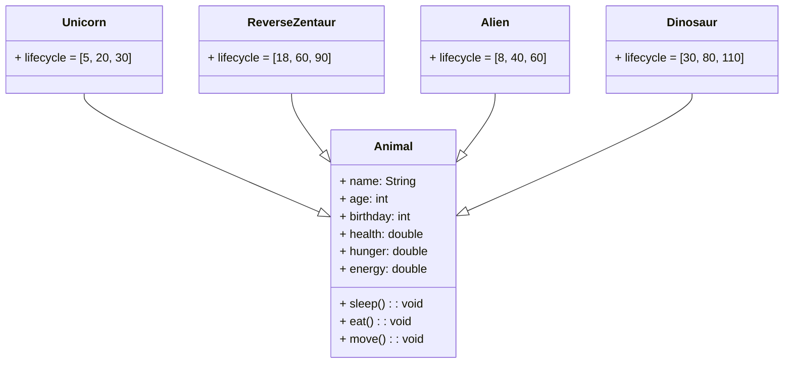

Animal class

```mermaid
classDiagram

class Animal {
    + name: String
    + age: int
    + birthday: int
    + health: double
    + hunger: double
    + energy: double
    + sleep(): void
    + eat(): void
    + move(): void
}


class Unicorn {
    + lifecycle = [5, 20, 30]
}
Unicorn --|> Animal

class ReverseZentaur {
    + lifecycle = [18, 60, 90]
}
ReverseZentaur --|> Animal


class Alien {
    + lifecycle = [8, 40, 60]
}
Alien --|> Animal


class Dinosaur {
    + lifecycle = [30, 80, 110]
}
Dinosaur --|> Animal


```