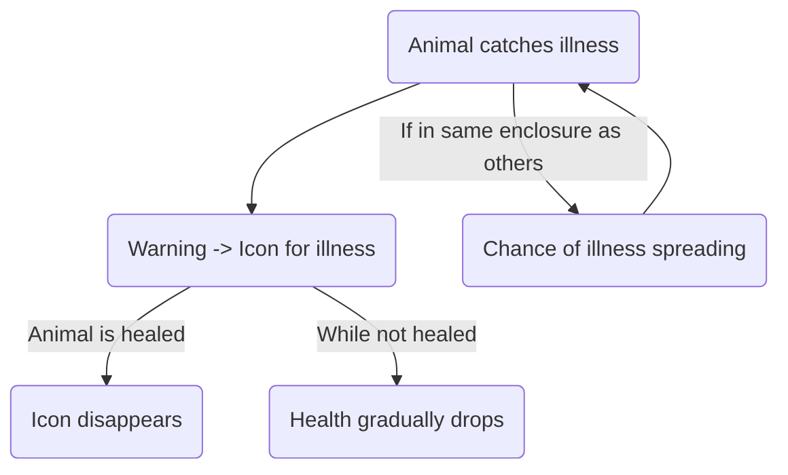
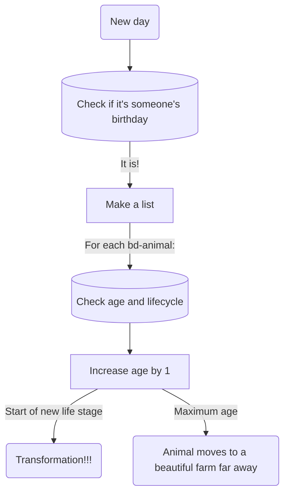
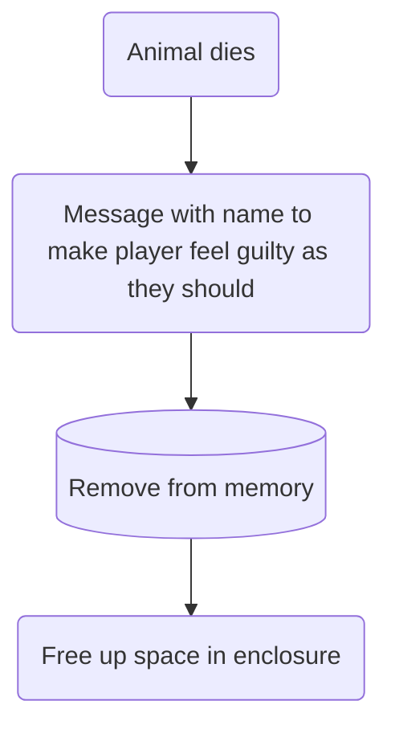
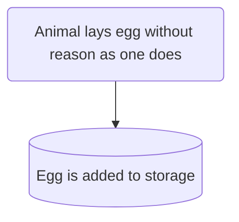

Illness

```mermaid
flowchart TD
id1(Animal catches illness)-->
id2(Warning -> Icon for illness)--Animal is healed-->
id3(Icon disappears)

id2--While not healed-->
id4(Health gradually drops)

id1--If in same enclosure as others-->
id5(Chance of illness spreading)-->
id1
```
---
Animal ages

```mermaid
flowchart TD
id1(New day)-->
DB1@{ shape: cyl, label: "Check if it's someone's birthday" }--It is!-->
id2@{ shape: rect, label: "Make a list" }--For each bd-animal:-->
DB2@{ shape: cyl, label: "Check age and lifecycle" }-->
id3@{ shape: rect, label: "Increase age by 1" }--Start of new life stage-->
id4(Transformation!!!)

id3--Maximum age-->
id5(Animal moves to a beautiful farm far away)
```
---
Animal dies

```mermaid
flowchart TD
id1(Animal dies)-->
id2(Message with name to make player feel guilty as they should)-->
DB1@{ shape: cyl, label: "Remove from memory" }-->
id3(Free up space in enclosure)
```
---
Animal is born

```mermaid
flowchart TD
id1(Animal lays egg without reason as one does)-->
DB1@{ shape: cyl, label: "Egg is added to storage" }
```