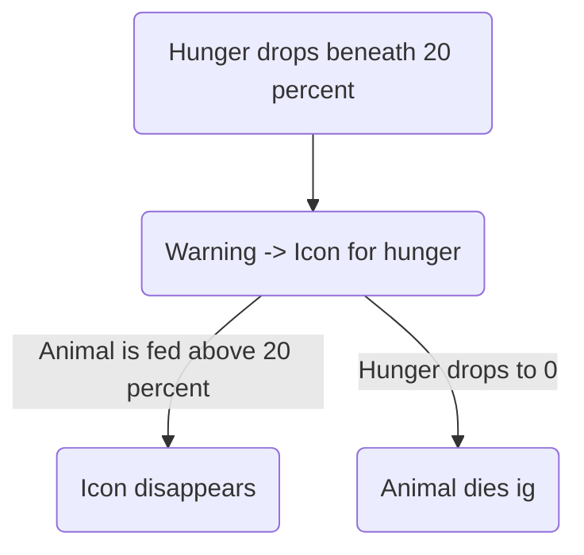
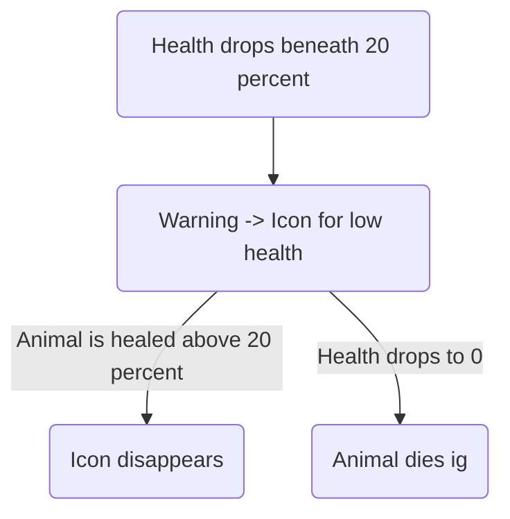

Hunger

```mermaid
flowchart TD
id1(Hunger drops beneath 20 percent)-->
id2(Warning -> Icon for hunger)--Animal is fed above 20 percent-->
id3(Icon disappears)

id2--Hunger drops to 0-->
id4(Animal dies ig)
```
---
Health

```mermaid
flowchart TD
id1(Health drops beneath 20 percent)-->
id2(Warning -> Icon for low health)--Animal is healed above 20 percent-->
id3(Icon disappears)

id2--Health drops to 0-->
id4(Animal dies ig)
```
