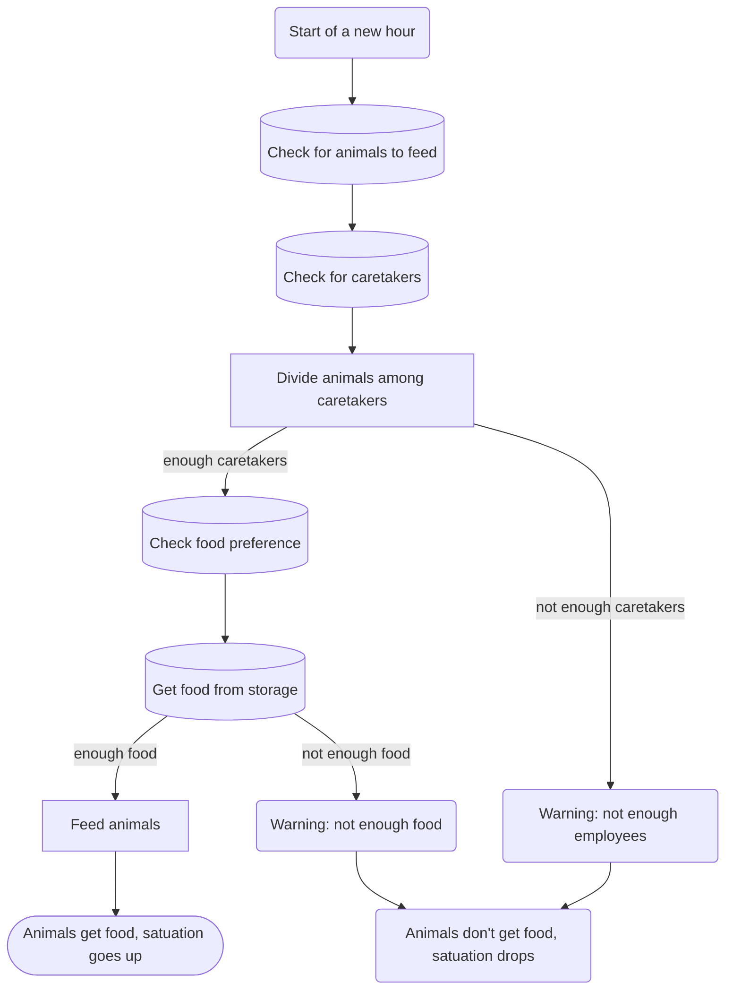
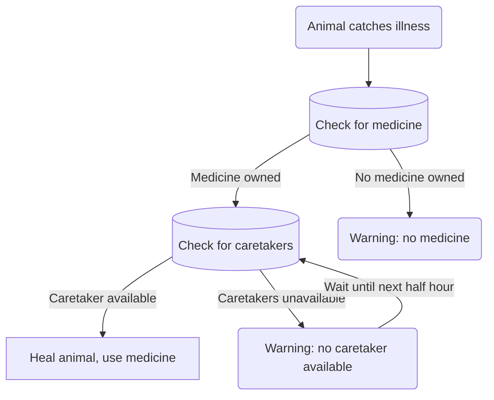

Feed animals

```mermaid
flowchart TD
id1(Start of a new hour) -->
DB@{ shape: cyl, label: "Check for animals to feed" }-->
DB2@{ shape: cyl, label: "Check for caretakers" }-->
id2@{ shape: rect, label: "Divide animals among caretakers" } --enough caretakers-->
DB3@{ shape: cyl, label: "Check food preference" }-->
DB4@{ shape: cyl, label: "Get food from storage" } --enough food-->
id7@{ shape: rect, label: "Feed animals" }-->
A@{ shape: stadium, label: "Animals get food, satuation goes up" }

id2 --not enough caretakers-->
id4(Warning: not enough employees)-->
id6

DB4 --not enough food-->
id5(Warning: not enough food)-->
id6(Animals don't get food, satuation drops)
```
--------
Cure illness

```mermaid
flowchart TD
id1(Animal catches illness)-->
DB1@{ shape: cyl, label: "Check for medicine" }--Medicine owned-->
DB2@{ shape: cyl, label: "Check for caretakers" }--Caretaker available-->
id2@{ shape: rect, label: "Heal animal, use medicine" }

DB1 --No medicine owned-->
id4(Warning: no medicine)

DB2--Caretakers unavailable-->
id3(Warning: no caretaker available) --Wait until next half hour-->
DB2
```